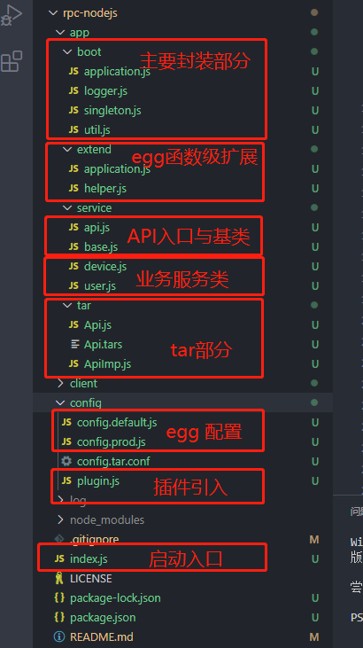

# rpc-nodejs

一个整合`egg-core`的`rpc`服务实现的快速开发脚手架，基于tars平台。可协同多插件提供RPC服务能力， 插件扩展可通过config下的配置文件来引入。


搭建整合的目的，只需要专注业务服务实现即可，需要什么引入什么，没有的可自己封装(参见egg插件封装说明)

java语言rpc的实现可参见本人搭建的 [rpc-spring](https://github.com/lingtoo/rpc-spring ) 开发脚手架 


# 目录说明



# 开发方式
1. 配置tar的服务命名空间

在`config/config.default.js` 配置你的命名空间

```
config.constant = {
  TARS: {
    APP_NAME: 'InduApp',
    SERVER_NAME: 'IwsServer',
    OBJ_NAME: 'DeviceObj'
  }
};
```

配置后，在服务中的调用如下：
```
let TarsConf = this.ctx.app.config.constant.TARS
TarsConf.APP_NAME
```


2. 引入你需要的插件

mysql引入示例
```
exports.mysql = {
  enable: true,
  package: 'egg-mysql',
};

```
mysql调用

```
  let app = this.ctx.app
  const tableName = 'user'
  const user = await app.mysql.get(tableName, { id });
  this.logger.info(user)
  return user
```


3. 开发你的业务

- 业务开发
在 `service` 目录下实现你的具体业务

详见源码 `$/servie/user.js` 与 `$/service/device.js` 的示例代码
```
const Service = require('./base')
class UserService extends Service { //继续base类
  //todo
}
```


- 业务调用

在 `tar/ApiImp.js`下发起你的调用，示例
```
let userService = this.ctx.service.user;
let userObj = await userService.getUserById(id) //调用具体的服务类
if (userObj) {
    user.id = userObj.id
    user.userName = userObj.userName
} else {
    user.id = 1;
    user.userName = 'test'
}
current.sendResponse(user);
```

4. 启动

- 本地（服务端）
```
node ./index.js
```

- 客户端调用 
```
cd client
node ./client.js
```

*ps：此DEMO要完全运行起，需要再配置下自己的mysql及redis连接信息,在`config/config.default.js`中; 同时导入testdata/hisdata.sql*

- 生产环境
上传打包好的文件即可，由tars平台会调用index.js启动


# Tar生成的实现类的扩展
在通过tars2node生成的实现类基础上，扩展其调用业务类的能力，改造如下

打开 `tar` 平台工具生成的实现类 `$/tar/ApiImp.js`

引入Util扩展函数
```
let Util = require('../boot/util')
```
在此类的底部添加
```
Api.ServiceImp = Util.getExtImpl(Api.ServiceImp) //实现类扩展
```

在此类原型方法上，即可调用具体业务服务类
```
Api.ServiceImp.prototype.getUserById = async function (current, id) {
    //这里打的日志，可在tar平台的日志中查看到
    this.logger.info('getUserById param::', id);
    let user = new Api.User();

    let userService = this.ctx.service.user;
    let userObj = await userService.getUserById(id) //调用服务类
    if (userObj) {
        user.id = userObj.id
        user.userName = userObj.userName
    } else {
        user.id = 1;
        user.userName = 'test'
    }
    current.sendResponse(user);
};
```


# 一点不完美的地方
在扩展tar生成的实现类的过程中，由于原源码的实现类是通过 `HeroServer.js` 来实例化的， 此JS源码需要做点小小改动。

定位到`node_modules/@tars/rpc/core/server/HeroServer.js ` 类，改写第 `117` 行：
```
  //adapter.handleImp = new this._servants[adapter.servantName](); // 注释掉，实例化提前
  adapter.handleImp = this._servants[adapter.servantName];
```
即可运行起来。


# 写在最后
本脚手架的诞生，是自己利用业余时间研究了`egg-core.js` 及 `tars.js`源码，对`egg-core`做了再次的定制与封装，并结合平时实际开发所需整合而成，前后断断续续花了一个多星期吧。

有兴趣的或有需求的小伙伴，可在此基础上再次扩展。


*有喜欢的小伙伴，点个star吧。*


